# 浅谈 MVC、MVP 和 MVVM 架构模式

+ [谈谈 MVX 中的 Model](https://github.com/Draveness/iOS-Source-Code-Analyze/blob/master/contents/architecture/mvx-model.md)
+ [谈谈 MVX 中的 View](https://github.com/Draveness/iOS-Source-Code-Analyze/blob/master/contents/architecture/mvx-view.md) 
+ [谈谈 MVX 中的 Controller](https://github.com/Draveness/iOS-Source-Code-Analyze/blob/master/contents/architecture/mvx-controller.md)
+ [浅谈 MVC、MVP 和 MVVM 架构模式](https://github.com/Draveness/iOS-Source-Code-Analyze/blob/master/contents/architecture/mvx.md)

> Follow GitHub: [Draveness](https://github.com/Draveness)

这是 MVX 系列的第四篇文章，在前面的文章中，我们先后介绍了 iOS 中的 Model、View 和 Controller 的现状，对比了其他平台中的设计，最后给出了作者理想中的结构。

而这一篇文章，作者会依次介绍 MVC、MVP 以及 MVVM 架构模式以及不同平台对它们的使用，虽然参考了很多资料，不过文中观点难免掺入作者的主观意见，作者也希望文中的错误与不足之处能被各位读者指出。

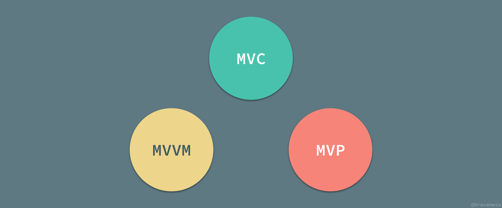

前面的几篇文章中重点都是介绍 iOS 平台上的 Model、View 和 Controller 如何设计，而这篇文章会对目前 GUI 应用中的 MVC、MVP 和 MVVM 架构模式进行详细地介绍。

## MVC

在整个 GUI 编程领域，MVC 已经拥有将近 50 年的历史了。早在几十年前，Smalltalk-76 就对 MVC 架构模式进行了实现，在随后的几十年历史中，MVC 产生了很多的变种，例如：HMVC、MVA、MVP、MVVM 和其它将 MVC 运用于其它不同领域的模式。

### 早期的 MVC

而本文的内容就是从 MVC 开始的，作为架构模式中最出名并且是应用最广泛的架构模式，MVC 并没有一个**明确的**定义，网上流传的 MVC 架构图也是形态各异，作者查阅了很多资料也没有办法确定到底什么样的架构图才是**标准的** MVC 实现。


最早的 MVC 的『架构图』是这样的，设计 MVC 的最重要目的就是在人的心智模型与计算机的模型之间建立一个桥梁。

> The essential purpose of MVC is to bridge the gap between the human user's mental model and the digital model that exists in the computer. The ideal MVC solution supports the user illusion of seeing and manipulating the domain information directly.
> --- [MVC Index](http://heim.ifi.uio.no/~trygver/themes/mvc/mvc-index.html)

最理想的 MVC 解决方案就是：**为用户提供直接看到信息和操作信息的功能**。

更早的概念类似 Model-View-Editor（MVE）这里就不再提及了，感兴趣的读者可以阅读这篇论文 [Thing-Model-View-Editor](http://heim.ifi.uio.no/~trygver/1979/mvc-1/1979-05-MVC.pdf) 了解更多的信息。

### 混乱的 MVC 架构

作者相信，稍有编程经验的开发者就对 MVC 有所了解，至少也是听过 MVC 的名字。我们都以为所有人理解的 MVC 的概念都一样，作者也一直都这么认为，很多人对于 MVVM 的实现有很大争论，说遵循什么什么架构的是 MVVM，MVVM 有什么组件、没有什么组件，而对于 MVC 仿佛没有那么大的疑问，这其实却不然。

#### ASP.NET MVC

在最近的几个月，作者发现不同人对于 MVC 的理解有巨大的差异，这是 [ASP.NET MVC Overview](https://msdn.microsoft.com/en-us/library/dd381412(v=vs.108).aspx) 一文中对于 MVC 模式描述的示意图。


图片中并没有对 Model、View 和 Controller 三者之间如何交互进行说明，有的也只是几个箭头。我们应该可以这么简单地理解：

1. 控制器负责管理视图和模型
2. 视图负责展示模型中的内容

> 由于文章没有明确对这三个箭头的含义进行解释，所以在这里也仅作推断，无法确认原作者的意思。

#### Spring MVC

与 ASP.NET 不同，Spring MVC 对于 MVC 架构模式的实现就更加复杂了，增加了一个用于分发请求、管理视图的 DispatchServlet：

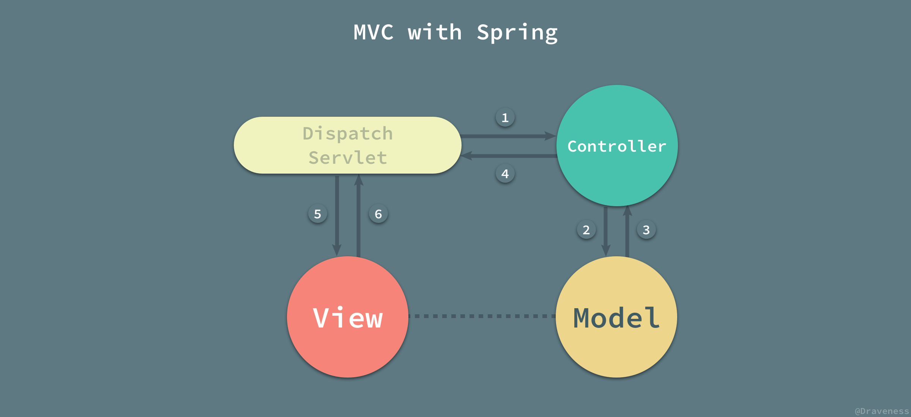

在这里不再介绍 Spring MVC 对于 HTTP 请求的处理流程，我们对其中 Model、View 和 Controller 之间的关系进行简单的分析：

1. 通过 Dispatch Servlet 将控制器曾和视图层完全解耦；
2. 视图层和模型层之间没有直接关系，只有间接关系，通过控制器对模型进行查询、返回给 DispatchServlet 后再传递至视图层；

虽然 Spring MVC 也声称自己遵循 MVC 架构模式，但是这里的 MVC 架构模式和 ASP.NET 中却有很大的不同。

#### iOS MVC

iOS 客户端中的 Cocoa Touch 自古以来就遵循 MVC 架构模式，不过因为 Cocoa Touch 对于 MVC 的实现，导致了其中的 MVC 的设计与我们常见的 MVC 非常不同。


在 iOS 中，由于 `UIViewController` 类持有一个根视图 `UIView`，所以视图层与控制器层是紧密耦合在一起的，这也是 iOS 项目经常遇到视图控制器非常臃肿的重要原因之一。

#### Rails MVC

Rails 作为著名的 MVC 框架，视图层和模型层也没有直接的耦合，而是通过控制器来进行信息的传递：

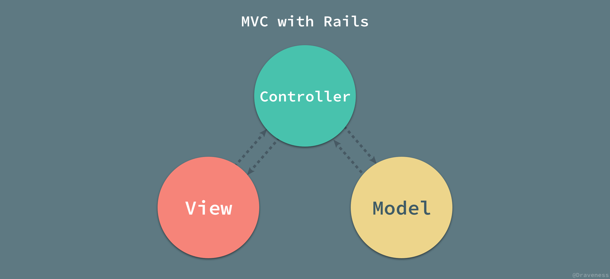

这种 MVC 的设计实现了视图层和模型层之间的解耦，作为承担数据存储功能的模型层，可以通过控制器同时为多种不同的视图提供数据：


控制器根据用户发出的 HTTP 请求，从模型中取出相同的数据，然后传给不同的视图以渲染出不同的结果。Rails 中的 MVC 架构模式能够很好地将用于展示的视图和用于存储数据的数据库进行分离，两者之间通过控制器简洁耦合，能够实现同一数据库对应多种视图的架构。

#### 维基百科中的 MVC

除了上述框架中的 MVC 架构模式，还有一些其它的书籍或者资料对于 MVC 也有着不同的解释，比如维基百科的 [Model-view-controller](https://en.wikipedia.org/wiki/Model–view–controller) 条目。

对于 MVC 解释的条目 [Model-view-controller](https://en.wikipedia.org/wiki/Model–view–controller) 是我们在 Google 搜索 [MVC](https://www.google.com/search?q=MVC) 时能够出现的前几个条目，这也是维基百科中的架构图能够出现在这篇文章中的原因 —— 有着较多的受众。


维基百科中对于 MVC 架构模式交互图的描述其实相比上面的图片还都是比较清晰的，这主要是因为它对架构图中的箭头进行了详细的说明，指出了这个关系到底表示什么。

1. 视图被用户看到
2. 用户使用控制器
3. 控制器操作模型
4. 模型更新视图

虽然说整个架构图的逻辑是可以说的通的，不过相比于前面的架构图总是感觉有一些奇怪，而在这幅图片中，视图和控制器之间是毫无关系的，这与前面见到的所有 MVC 架构模式都完全不同，作者也不清楚这幅图来源是什么、为什么这么画，放在这里也仅作参考。

### 『标准』的 MVC

到底什么才是标准的 MVC 这个问题，到现在作者也没有一个**确切的**答案；不过通过研究多个框架以及书籍，对 MVC 的理解缺有一点是完全相同的，也就是它们都将整个应用分成三个部分，而这些组成部分其实也有着非常相似的职责。

+ 视图：管理作为位图展示到屏幕上的图形和文字输出；
+ 控制器：翻译用户的输入并依照用户的输入操作模型和视图；
+ 模型：管理应用的行为和数据，响应数据请求（经常来自视图）和更新状态的指令（经常来自控制器）；

> 上述内容出自 [Applications Programming in Smalltalk-80: How to use Model-View-Controller (MVC)](http://www.dgp.toronto.edu/~dwigdor/teaching/csc2524/2012_F/papers/mvc.pdf) 一文。

作者所理解的真正 MVC 架构模式其实与 ASP.NET 中对于 MVC 的设计完全相同：


控制器负责对模型中的数据进行更新，而视图向模型中请求数据；当有用户的行为触发操作时，惠友控制器更新模型，并通知视图进行更新，在这时视图向模型请求新的数据，而这就是**作者所理解的**标准 MVC 模式下，Model、View 和 Controller 之间的协作方式。

#### 依赖关系

虽然我们对 MVC 中的各个模块的交互不是特别了解，但是三者之间的依赖关系却是非常明确的；在 MVC 中，模型层可以单独工作，而视图层和控制器层都依赖与模型层中的数据。

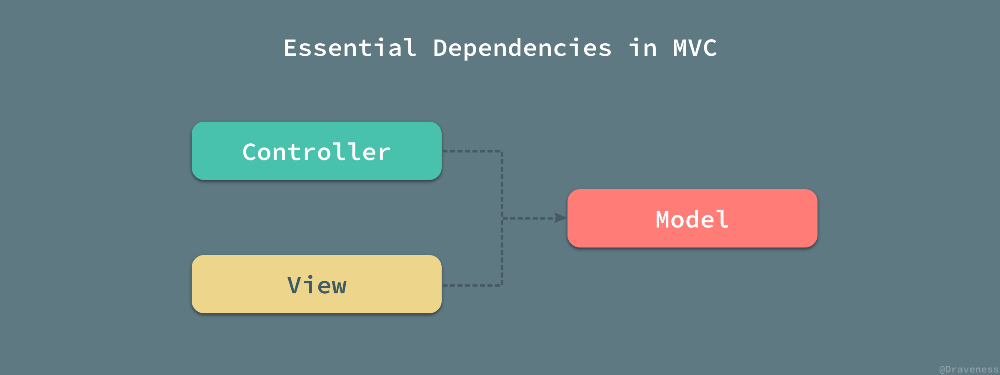

> 虽然如上图所示，视图和控制器之间没有相互依赖，不过因为视图和控制器之间的依赖并不常用，所以图中将视图和控制器之间的依赖省略了。

#### 分离展示层

在 Martin Fowler 对于 Model-View-Controller 的描述中，MVC 最重要的概念就是分离展示层 [Separated Presentation](https://www.martinfowler.com/eaaDev/SeparatedPresentation.html)，如何在领域对象（Domain Object）和我们在屏幕上看到的 GUI 元素进行划分是 MVC 架构模式中最核心的问题。

GUI 应用程序由于其需要展示内容的特点，分为两个部分：一部分是用于展示内容的展示层（Presentation Layer），另一部分包含领域和数据逻辑的领域层（Domain Layer）。


展示层依赖于领域层中存储的数据，而领域层对于展示层一无所知，领域层其实也是 MVC 模式中的模型层，而展示层可以理解为 VC 部分。

MVC 最重要的目的并不是规定各个模块应该如何交互和联系，而是将原有的混乱的应用程序划分出合理的层级，把一团混乱的代码，按照展示层和领域层分成两个部分；在这时，领域层中的领域对象由于其自身特点不需要对展示层有任何了解，可以同时为不同的展示层工作。

#### 观察者同步

除了分离展示层，MVC 还与观察者同步 [Observer Synchronization](https://www.martinfowler.com/eaaDev/MediatedSynchronization.html) 关系紧密。因为在 MVC 模式中，模型可以单独工作，并且它对于使用模型中数据的视图和控制器一无所知，为了保持模型的独立性，我们需要一种机制，当模型发生改变时，能够同时更新多个视图和控制器的内容；在这时，就需要以观察者同步的方式解决这个问题。


我们将所有需要实时更新的组件注册成为模型的观察者，在模型的属性发生变化时，通过观察者模式推送给所有注册的观察者（视图和控制器）。

当多个视图共享相同的数据时，观察者同步是一个非常关键的模式，它能够通知多个视图；通过观察者模式，我们也可以非常容易的创建一个依赖于同一模型的视图。

观察者同步或者说观察者模式的主要缺点就是：由于事件触发的隐式行为可能导致很难查找问题的来源并影响其解决，不过虽然它有着这样的缺点，但是观察者同步这一机制仍然成为 MVC 以及其衍生架构模式中非常重要的一部分。

#### 占主导地位的控制器

MVC 架构模式的三个组成部分：Model、View 和 Controller 中最重要的就是控制器，它承担了整个架构中的大部分业务逻辑，同时在用户请求到达或者事件发生时都会首先通知控制器并由它来决定如何响应这次请求或者事件。


在 MVC 中，所有的用户请求都会首先交给控制器，由控制器来决定如何响应用户的输入，无论是更新模型中的信息还是渲染相应的视图，都是通过控制器来决定的；也就是说，在 MVC 中，控制器占据主导地位，决定一个用户输入是如何被处理的。

#### 被动的模型

在绝大多数的 MVC 架构模式中，模型都不会主动向视图或者控制器推送消息；模型都是被动的，它只存储整个应用中的数据，无论是获取信息还是更新数据都由控制器来驱动。

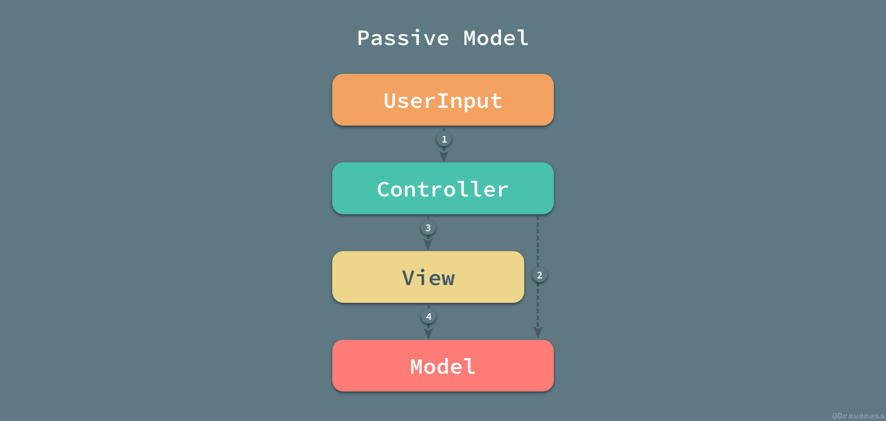

但是当模型中的数据发生变化时，却需要通过一些方式通知对应的视图进行更新，在这种情况下其实也不需要模型**主动**将数据变化的消息推送给视图；因为所有对于模型层的改变都是**由用户的操作导致的**，而用户的操作都是通过控制器来处理的，所以只需要在控制器改变模型时，将更新的信息发送给视图就可以了；当然，我们也可以通过**观察者模式**向位置的观察者发送通知，以保证状态在不同模块之间能够保持同步。

作为被动的模型层，它对于视图和控制器的存在并不知情，只是向外部提供接口并响应视图和控制器对于数据的请求和更新操作。

#### MVC + MVC

目前的大多数应用程序都非常复杂并且同时包含客户端和服务端，两者分开部署但同时又都遵循 MVC 或者衍生的架构模式；过去的 Web 应用由于并不复杂，前端和服务端往往都部署在同一台服务器上，比如说使用 erb 模板引擎的 Rails 或者使用 jsp 的 Java 等等；在这时，整个 Web 应用遵循 MVC 架构模式：

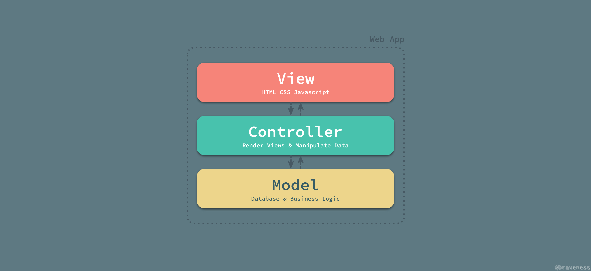

这里的 MVC 架构模式的通信方式与标准的 MVC 中不同，上图以 Rails 为例展示其中的 MVC 是如何工作的，其中的 HTML、CSS 和 Javascript 代码就是视图层，控制器负责视图的渲染并且操作模型，模型中包含部分业务逻辑并负责管理数据库。

过去的 Web 应用的非常简单，而现在的应用程序都非常复杂，而整个应用程序无论是 Web 还是客户端其实都包含两个部分，也就是前端/客户端和后端；先抛开后端不谈，无论是 Web 前端、iOS 还是 Android 都遵循 MVC 架构模式或者其衍生的各种模式。


在实际情况下，单独的 iOS、Android 和 Web 应用往往不能单独工作，这些客户端应用需要与服务端一起工作；当前端/客户端与后端一同工作时，其实分别『部署』了两个不同的应用，这两个应用都遵循 MVC 架构模式：


客户端和服务器通过网络进行连接，并组成了一个更大的 MVC 架构；从这个角度来看，服务端的模型层才存储了真正的数据，而客户端的模型层只不过是一个存储在客户端设备中的本地缓存和临时数据的集合；同理，服务端的视图层也不是整个应用的视图层，用于为用户展示数据的视图层位于客户端，也就是整个架构的最顶部；中间的五个部分，也就是从低端的模型层到最上面的视图共同组成了整个应用的控制器，将模型中的数据以合理的方式传递给最上层的视图层用于展示。

## MVP

MVP 架构模式是 MVC 的一个变种，很多框架都自称遵循 MVC 架构模式，但是它们实际上却实现了 MVP 模式；MVC 与 MVP 之间的区别其实并不明显，作者认为两者之间最大的区别就是 MVP 中使用 Presenter 对视图和模型进行了解耦，它们彼此都对对方一无所知，沟通都通过 Presenter 进行。

MVP 作为一个比较有争议的架构模式，在维基百科的 [Model-view-presenter](https://en.wikipedia.org/wiki/Model–view–presenter) 词条中被描述为 MVC 设计模式的变种（derivation），自上个世纪 90 年代出现在 IBM 之后，随着不断的演化，虽然有着很多分支，不过 Martin Fowler 对 MVP 架构模式的定义最终被广泛接受和讨论。


在 MVP 中，Presenter 可以理解为松散的控制器，其中包含了视图的 UI 业务逻辑，所有从视图发出的事件，都会通过代理给 Presenter 进行处理；同时，Presenter 也通过视图暴露的接口与其进行通信。

目前常用的 MVP 架构模式其实都是两种变种：[Passive View](https://www.martinfowler.com/eaaDev/PassiveScreen.html) 和 [Supervising Controller](https://www.martinfowler.com/eaaDev/SupervisingPresenter.html)，接下来的内容也是围绕这两种变种进行展开的。

### 被动视图

MVP 的第一个主要变种就是被动视图（Passive View）；顾名思义，在该变种的架构模式中，视图层是被动的，它本身不会改变自己的任何的状态，所有的状态都是通过 Presenter 来间接改变的。

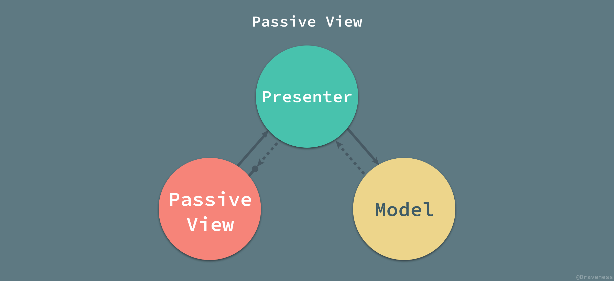

被动的视图层就像前端中的 HTML 和 CSS 代码，只负责展示视图的结构和内容，本身不具有任何的逻辑：

```swift
<article class="post">
  <header class="post-header">
    <h2 class="post-title"><a href="/mvx-controller.html">谈谈 MVX 中的 Controller</a></h2>
  </header>
  <section class="post-excerpt">
    <p>在前两篇文章中，我们已经对 iOS 中的 Model 层以及 View 层进行了分析，划分出了它们的具体职责，其中 Model 层除了负责数据的持久存储、缓存工作，还要负责所有 HTTP... <a class="read-more" href="/mvx-controller.html">&raquo;</a></p>
  </section>
  <footer class="post-meta">
    
    <a href='/author/draveness'>Draveness</a>
    <time class="post-date" datetime="2017-06-23">23 Jun 2017</time>
  </footer>
</article>
```

#### 依赖关系

视图成为了完全被动的并且不再根据模型来更新视图本身的内容，也就是说，不同于 MVC 中的依赖关系；在被动视图中，视图层对于模型层没有任何的依赖：

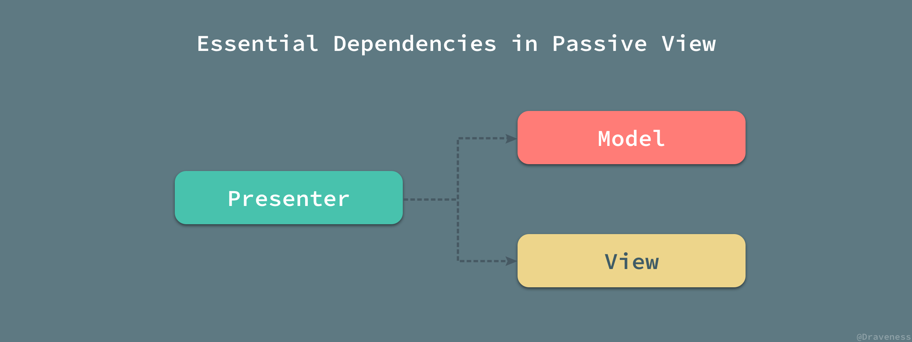

因为视图层不依赖与其他任何层级也就最大化了视图层的可测试性，同时也将视图层和模型层进行了合理的分离，两者不再相互依赖。

#### 通信方式

被动视图的示意图中一共有四条线，用于表示 Model、View 和 Presenter 之间的通信：


1. 当视图接收到来自用户的事件时，会将事件转交给 Presenter 进行处理；
2. 被动的视图向外界暴露接口，当需要更新视图时 Presenter 通过视图暴露的接口更新视图的内容；
3. Presenter 负责对模型进行操作和更新，在需要时取出其中存储的信息；
4. 当模型层改变时，可以将改变的信息发送给**观察者** Presenter；

在 MVP 的变种被动视图中，模型的操作以及视图的更新都仅通过 Presenter 作为中间人进行。

### 监督控制器

与被动视图中状态同步都需要**显式**的操作不同，监督控制器（Supervising Controller）就将部分需要显式同步的操作变成了隐式：

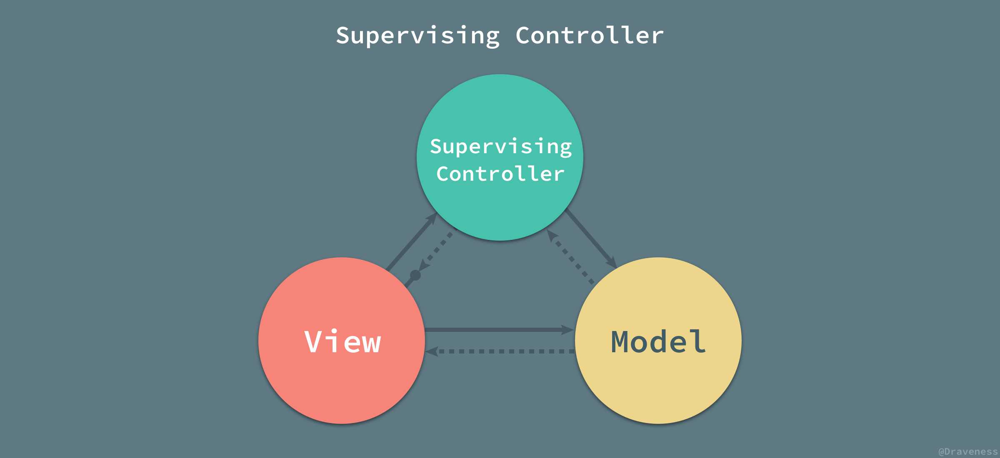

在监督控制器中，视图层接管了一部分视图逻辑，主要内容就是同步**简单的**视图和模型的状态；而监督控制器就需要负责响应用户的输入以及一部分更加复杂的视图、模型状态同步工作。

对于用户输入的处理，监督控制器的做法与标准 MVP 中的 Presenter 完全相同；但是对于视图、模型的同步工作，监督控制器会尽可能地将所有简单的属性**以数据绑定的形式声明在视图层中**，类似于 Vue 中双向绑定的简化版本：

```html
<a v-bind:href="url"></a>
```

剩下的无法通过上述方式直接绑定的属性就需要通过监督控制器来操作和更新了。

#### 通信方式

监督控制器中的视图和模型层之间增加了两者之间的耦合，也就增加了整个架构的复杂性：

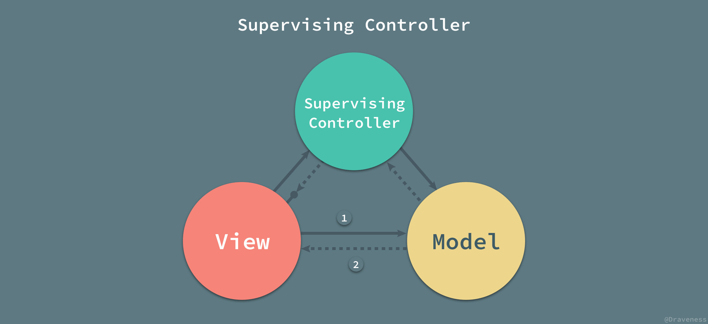

视图和监督控制器、模型与监督控制器的关系与被动视图中两者与 Presenter 的关系几乎相同，视图和模型之间新增的依赖就是数据绑定的产物；视图通过声明式的语法与模型中的简单属性进行绑定，当模型发生改变时，会通知其观察者视图作出相应的更新。

通过这种方式能够减轻监督控制器的负担，减少其中简单的代码，将一部分逻辑交由视图进行处理；这样也就导致了视图同时可以被 Presenter 和数据绑定两种方式更新，相比于被动视图，监督控制器的方式也降低了视图的可测试性和封装性。

### 占主导地位的视图

无论是在被动视图还是监督控制器版本的 MVP 架构模式中，视图层在整个架构中都是占主导地位的：

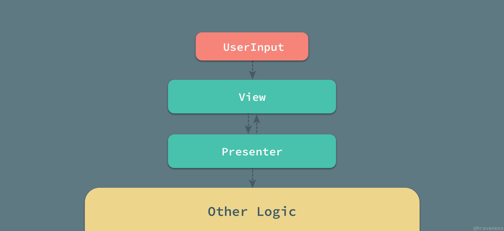

在 MVC 中，控制器负责**以不同的视图响应客户端请求的不同动作**；然而，不同于 MVC 模式，MVP 中视图将所有的动作交给 Presenter 进行处理；MVC 中的所有的动作都对应着一个控制器的方法调用，Web 应用中的每一个动作都是对某一个 URL 进行的操作，控制器根据访问的路由和方法（GET 等）对数据进行操作，最终选择正确的视图进行返回。

MVC 中控制器返回的视图没有直接绑定到模型上，它仅仅被控制器渲染并且是完全无状态的，其中不包含任何的逻辑，但是 MVP 中的视图**必须要将对应的事件代理给 Presenter 执行**，否则事件就无法被响应。

另一个 MVP 与 MVC 之间的重大区别就是，MVP（Passive View）中的视图和模型是完全解耦的，它们对于对方的存在完全不知情，这也是区分 MVP 和 MVC 的一个比较容易的方法。

> 上述内容取自 [What are MVP and MVC and what is the difference? · Stack Overflow](https://stackoverflow.com/questions/2056/what-are-mvp-and-mvc-and-what-is-the-difference) 中的 Model-View-Controller 部分。

## MVVM

相较于 MVC 和 MVP 模式，MVVM 在定义上就明确得多，同时，维基百科上对于 [Model-View-ViewModel](https://en.wikipedia.org/wiki/Model–view–viewmodel) 的词条也没有歧义；不过，在谈 MVVM 架构模式之前，我们需要先了解它是如何发展和演变的。

### MVVM 的演变

早在 2004 年，Martin Fowler 发表了一篇名为 [Presentation Model](https://www.martinfowler.com/eaaDev/PresentationModel.html) （以下简称为 PM 模式）的文章，PM 模式与 MVP 比较相似，它从视图层中分离了行为和状态；PM 模式中创建了一个视图的抽象，叫做 Presentation Model，而视图也成为了这个模型的『渲染』结果。


2005 年，John Gossman 在他的博客上公布了 [Introduction to Model/View/ViewModel pattern for building WPF apps](https://blogs.msdn.microsoft.com/johngossman/2005/10/08/introduction-to-modelviewviewmodel-pattern-for-building-wpf-apps/) 一文。MVVM 与 Martin Fowler 所说的 PM 模式其实是完全相同的，Fowler 提出的 PM 模式是一种与平台无关的创建视图抽象的方法，而 Gossman 的 MVVM 是专门用于 WPF 框架来简化用户界面的创建的模式；我们可以认为 **MVVM 是在 WPF 平台上对于 PM 模式的实现**。

> 有兴趣的读者可以阅读 [Introduction to Model/View/ViewModel pattern for building WPF apps](https://blogs.msdn.microsoft.com/johngossman/2005/10/08/introduction-to-modelviewviewmodel-pattern-for-building-wpf-apps/ · MSDN) 获得更多与 MVVM 演化的相关信息。

### 展示模型

> 本节大部分内容都节选自 Martin Fowler 的 [Presentation Model](https://www.martinfowler.com/eaaDev/PresentationModel.html) 译文。

既然 MVVM 是展示模型 [Presentation Model](https://www.martinfowler.com/eaaDev/PresentationModel.html) 的一个实现，那么在介绍 Model-View-ViewModel 之前，我们就需要了解 PM 模式到底是什么？

我们在 MVC 一节中曾经有过对展示层和领域层进行分离的讨论，而 PM 模式就与分离展示层 [Separated Presentation](https://www.martinfowler.com/eaaDev/SeparatedPresentation.html) 有一定的关系。

作为 Martin Fowler 在 2004 年提出的概念，Presentation Model 到今天其实也是非常先进的，PM 模式将视图中的全部状态和行为放到一个单独的展示模型中，协调领域对象（模型）并且为视图层提供一个接口。

在监督控制器中，视图层与模型层中的一些简单属性进行绑定，在模型属性变化时直接更新视图，而 PM 通过引入展示模型将模型层中的数据与复杂的业务逻辑封装成属性与简单的数据同时暴露给视图，让视图和展示模型中的属性进行**同步**。


展示模型中包含所有的视图渲染需要的动态信息，包括视图的内容（text、color）、组件是否启用（enable），除此之外还会将一些方法暴露给视图用于某些事件的响应。

#### 状态的同步

展示模型对于模型层的操作以及为视图层暴露接口都是非常容易的，在整个 PM 模式中，最为麻烦的就是视图和展示模型状态的同步。

因为展示模型是视图的抽象，其中包含了视图的状态（属性）和行为（动作），视图的行为可能很少发生改变，但是视图状态的改变就是非常常见的了，那么同步视图和展示模型的代码应该放哪里就是一个需要考虑的问题了。

到目前为止，我们能够防止状态同步代码的地方其实只有两个，也就是视图和展示模型；如果将同步的代码放在视图中，那么可能会影响视图的测试，不过由于现在的大部分客户端程序完全没有测试，这一点其实也影响不大；如果将代码放在展示模型中，我们实际上就为展示模型增加了视图的依赖，导致不同层级之间的耦合。

> 在作者看来这两种选择其实都影响并不大，反正我们的应用中并没有测试嘛。

#### 展示模型与其他模块的关系

在 PM 模式中，同一个展示模型可以与多个领域对象交互，多个视图可以使用相同的展示模型，但是每一个视图只能持有一个展示模型。

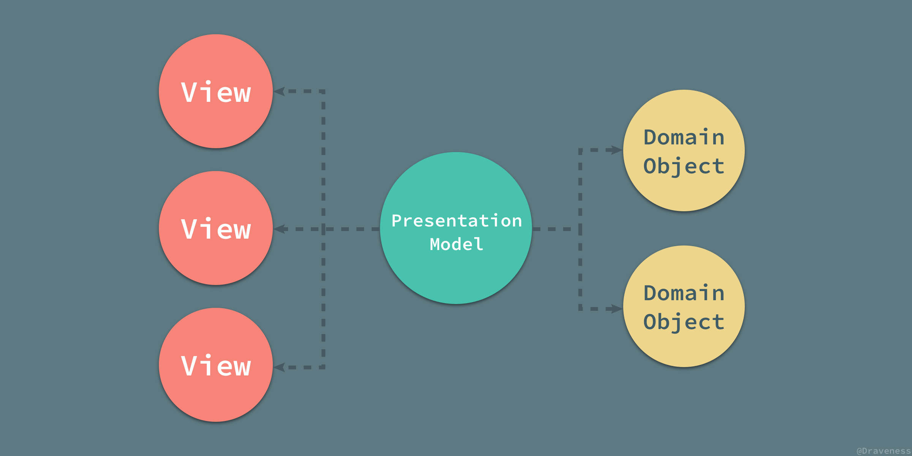

PM 模式中不同层级之间的关系还是非常容易理解的，在这里就不做具体解释了。

### MVVM 与 WPF

MVVM 架构模式是微软在 2005 年诞生的，从诞生一开始就与 WPF 框架的联系非常紧密，在这一节中，我们将介绍 MVVM 模式是如何遵循 PM 模式实现的，WPF 作为微软用于处理 GUI 软件的框架，提供了一套非常优雅的解决方案。


从 Model-View-ViewModel 这个名字来看，它由三个部分组成，也就是 Model、View 和 ViewModel；其中视图模型（ViewModel）其实就是 PM 模式中的展示模型，在 MVVM 中叫做视图模型。

除了我们非常熟悉的 Model、View 和 ViewModel 这三个部分，在 MVVM 的实现中，还引入了**隐式的**一个 Binder 层，而声明式的数据和命令的绑定在 MVVM 模式中就是通过它完成的。


在实现 PM 模式时，我们需要处理视图和展示模型之间状态的同步，也就是 MVVM 中的视图和视图模型，我们使用隐式的 Binder 和 XAML 文件来完成视图和视图模型两者之间的双向绑定：

```xml
<Window x:Class ="WPFDataBinding.MainWindow" Title="MainWindow" Height="350" Width="604"> 
   <Grid>
      <Label Name="nameLabel" Margin="2">_Name:</Label>
      <TextBox Name="nameText" Grid.Column="1" Margin="2" 
         Text="{Binding Name}"/>
      <Label Name="ageLabel" Margin="2" Grid.Row ="1">_Age:</Label> 
      <TextBox Name="ageText" Grid.Column="1" Grid.Row ="1" Margin ="2" 
         Text="{Binding Age}"/>
   </Grid>
</Window> 
```

在 WPF 中我们可以使用 Binding 关键字在 XAML 中完成双向绑定，当 `TextBox` 中的文字更新时，Binder 也会更新 ViewModel 中对应属性 `Name` 或者 `Age` 的值。

我们可以说 MVVM 将视图和展示模型之间的同步代码放到了视图层（XAML）中，也可以说通过隐式的方法实现了状态的同步。

无论是 MVVM 还是 Presentation Model，其中最重要的不是如何同步视图和展示模型/视图模型之间的状态，是使用观察者模式、双向绑定还是其它的机制都不是整个模式中最重要的部分，最为关键的是**展示模型/视图模型创建了一个视图的抽象，将视图中的状态和行为抽离出一个新的抽象**，这才是 MVVM 和 PM 中需要注意的。

## 总结

从 MVC 架构模式到 MVVM，从分离展示层到展示模型层，经过 20 多年的演变，MVC 架构模式出现了各种各样的变种，并在不同的平台上有着自己的实现。

在架构模式的选用时，我们往往没有太多的发言权，主要因为平台本身往往对应用层有着自己的设计，我们在开发客户端或者前端应用时，只需要遵循平台固有的设计就可以完成应用的开发，不过，在有些时候，由于工程变得庞大、业务逻辑变得异常复杂，我们也可以考虑在原有的架构之上实现一个新的架构以满足工程商的需要。

各种架构模式的作用就是分离关注，将属于不同模块的功能分散到合适的位置中，同时尽量降低各个模块的相互依赖并且减少需要联系的胶水代码。文中对于 MVC、MVP 和 MVVM 架构模式的描述很难不掺杂作者的主观意见，如果对文章中的内容有疑问，欢迎提出不同的意见进行讨论。

## Reference

+ [MVC Index](http://heim.ifi.uio.no/~trygver/themes/mvc/mvc-index.html)
+ [The Model-View-Controller (MVC) Its Past and Present](http://heim.ifi.uio.no/~trygver/2003/javazone-jaoo/MVC_pattern.pdf)
+ [The evolution of the Dolphin Smalltalk MVP application framework](http://www.object-arts.com/downloads/papers/TwistingTheTriad.PDF)
+ [MVP: Model-View-Presenter · The Taligent Programming Model for C++ and Java](http://www.wildcrest.com/Potel/Portfolio/mvp.pdf)
+ [Implementing the Model-View-ViewModel Pattern · MSDN](https://msdn.microsoft.com/en-us/library/ff798384.aspx)
+ [GUI Architectures · Martin Fowler](https://martinfowler.com/eaaDev/uiArchs.html)
+ [GUI 应用程序架构的十年变迁](https://zhuanlan.zhihu.com/p/26799645)
+ [Elm Architecture Tutorial · GitHub](https://github.com/evancz/elm-architecture-tutorial/)
+ [Presentation Model · Martin Fowler](https://martinfowler.com/eaaDev/PresentationModel.html)
+ [Model-view-controller · Wikipedia](https://en.wikipedia.org/wiki/Model–view–controller)
+ [Model-view-presenter · Wikipedia](https://en.wikipedia.org/wiki/Model–view–presenter)
+ [Model-view-viewmodel · Wikipedia](https://en.wikipedia.org/wiki/Model–view–viewmodel)
+ [Thing-Model-View-Editor](http://heim.ifi.uio.no/~trygver/1979/mvc-1/1979-05-MVC.pdf)
+ [ASP.NET MVC Overview · MSDN](https://msdn.microsoft.com/en-us/library/dd381412(v=vs.108).aspx)
+ [Intermediate Rails: Understanding Models, Views and Controllers](https://betterexplained.com/articles/intermediate-rails-understanding-models-views-and-controllers/)
+ [Passive View · Martin Fowler](https://www.martinfowler.com/eaaDev/PassiveScreen.html)
+ [Supervising Controller · Martin Fowler](https://www.martinfowler.com/eaaDev/SupervisingPresenter.html)
+ [Applications Programming in Smalltalk-80: How to use Model-View-Controller (MVC)](http://www.dgp.toronto.edu/~dwigdor/teaching/csc2524/2012_F/papers/mvc.pdf)
+ [What are MVP and MVC and what is the difference? · Stack Overflow](https://stackoverflow.com/questions/2056/what-are-mvp-and-mvc-and-what-is-the-difference)
+ [Model-View-Presenter Pattern](http://webclientguidance.codeplex.com/wikipage?title=ModelViewPresenterPatternDescription&referringTitle=MVPDocumentation)
+ [Patterns - WPF Apps With The Model-View-ViewModel Design Pattern · MSDN](https://msdn.microsoft.com/en-us/magazine/dd419663.aspx)
+ [Introduction to Model/View/ViewModel pattern for building WPF apps](https://blogs.msdn.microsoft.com/johngossman/2005/10/08/introduction-to-modelviewviewmodel-pattern-for-building-wpf-apps/)
+ [设计模式](https://en.wikipedia.org/wiki/Design_Patterns)

> The basic MVC notion assumes that all the state of the view can be derived from the state of the model.


